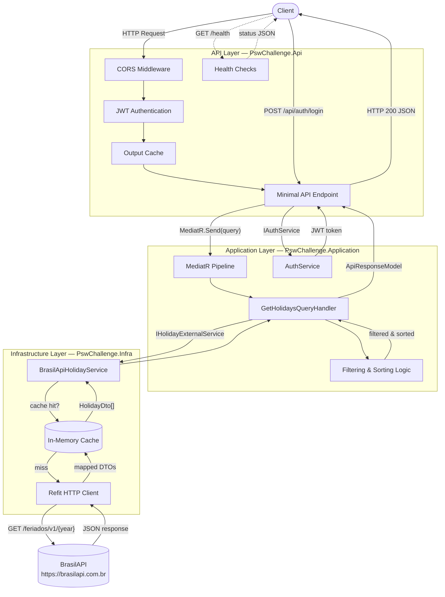

[](https://sonarcloud.io/summary/new_code?id=peterson-lc_psw-digital-backend-challenge)
[](https://sonarcloud.io/summary/new_code?id=peterson-lc_psw-digital-backend-challenge)

# PSW Digital Backend Challenge

A RESTful API built with .NET 10 that provides Brazilian holiday data sourced from the [BrasilAPI](https://brasilapi.com.br/), secured with JWT authentication.

---

## Table of Contents

- [Frameworks and Technologies](#frameworks-and-technologies)
- [Data Flow Diagram](#data-flow-diagram)
- [Architecture Pattern](#architecture-pattern)
- [Layer Responsibilities](#layer-responsibilities)
- [Project Structure](#project-structure)
- [API Endpoints](#api-endpoints)
- [Running the Application](#running-the-application)

---

## Frameworks and Technologies

### Runtime & Framework

| Technology | Version | Purpose |
|---|---|---|
| **.NET** | 10.0 | Target framework |
| **ASP.NET Core** | 10.0 | Web API framework (Minimal APIs) |

### Application Libraries

| Library | Version | Purpose |
|---|---|---|
| **MediatR** | 14.1.0 | CQRS mediator for decoupling requests from handlers |
| **Refit** | 10.0.1 | Type-safe REST client for the BrasilAPI integration |
| **Refit.HttpClientFactory** | 10.0.1 | HttpClientFactory integration for Refit |
| **Swashbuckle.AspNetCore** | 10.1.5 | Swagger / OpenAPI documentation |
| **Microsoft.AspNetCore.Authentication.JwtBearer** | 10.0.5 | JWT Bearer token authentication |
| **System.IdentityModel.Tokens.Jwt** | 8.16.0 | JWT token generation and validation |
| **Microsoft.Extensions.Caching.Memory** | 10.0.5 | In-memory caching (cache-aside pattern) |
| **Microsoft.Extensions.Options** | 10.0.5 | Strongly-typed configuration binding |

### Testing Libraries

| Library | Version | Purpose |
|---|---|---|
| **xUnit** | 2.9.3 | Unit testing framework |
| **Moq** | 4.20.70 | Mocking framework |
| **FluentAssertions** | 6.12.1 | Fluent assertion syntax |
| **Microsoft.AspNetCore.Mvc.Testing** | 10.0.5 | Integration testing with `WebApplicationFactory` |
| **Microsoft.NET.Test.Sdk** | 17.14.1 | Test SDK |
| **coverlet.collector** | 6.0.4 | Code coverage collection |

### Infrastructure

| Tool | Purpose |
|---|---|
| **Docker** | Containerised builds and deployment |
| **Central Package Management** | Single `Directory.Packages.props` for version control |

---

## Data Flow Diagram

The diagram below shows how a request to fetch holidays travels through every layer of the application and back to the client.



### Request Lifecycle (Holidays)

1. **Client** sends `GET /api/holidays/{year}?name=...&type=...&date=...&orderBy=...`
2. **CORS middleware** adds cross-origin headers.
3. **JWT Authentication** validates the Bearer token.
4. **Output Cache** returns a cached response if one exists for the same route + query combination (24 h TTL).
5. **Minimal API Endpoint** builds a `GetHolidaysQuery` record and dispatches it through **MediatR**.
6. **GetHolidaysQueryHandler** calls `IHolidayExternalService.GetHolidaysByYearAsync(year)`.
7. **BrasilApiHolidayService** checks the **in-memory cache** (keyed by year, 24 h TTL).
   - **Cache hit** → returns cached `HolidayDto` list immediately.
   - **Cache miss** → calls the **BrasilAPI** via the **Refit** client, maps the response to `HolidayDto` objects, stores them in cache, and returns.
8. The handler applies **filtering** (name with accent-insensitive matching, type, date) and **sorting** (date, name, or type).
9. The result is wrapped in `ApiResponseModel<HolidaysResponseModel>` and returned as JSON.

---

## Architecture Pattern

The solution follows a **Clean Architecture / Layered Architecture** pattern with three distinct projects. Dependencies flow **inward** — outer layers depend on inner layers, never the reverse.

```
┌──────────────────────────────────────────────────┐
│              PswChallenge.Api                     │  ← Outermost (entry point)
│         Endpoints · Middleware · Health           │
├──────────────────────────────────────────────────┤
│           PswChallenge.Infra                      │  ← Infrastructure
│     Refit clients · Caching · DI wiring          │
├──────────────────────────────────────────────────┤
│         PswChallenge.Application                  │  ← Core (innermost)
│   Queries · Handlers · Services · Models · DTOs  │
└──────────────────────────────────────────────────┘
```

**Dependency direction:**

```
Api  ──references──▶  Application
Api  ──references──▶  Infra
Infra ──references──▶  Application
```

`Application` has **zero** project references — it is the core of the system and defines the contracts (interfaces) that `Infra` implements.

---

## Layer Responsibilities

### 1. API Layer — `PswChallenge.Api`

> **Role:** HTTP entry point. Receives requests, delegates work, returns responses.

#### Contains

| Component | Location | Purpose |
|---|---|---|
| `Program.cs` | Root | Application bootstrap, DI registration, middleware pipeline |
| Minimal API Endpoints | `Endpoints/Auth/`, `Endpoints/Holidays/` | Route definitions and parameter binding |
| Exception Handlers | `ExceptionHandler/`, `Middlewares/` | Global error handling |
| Health Checks | `HealthChecks/` | Liveness / readiness probes (`/health`, `/healthz`) |
| Configuration files | `appsettings.json` | JWT, BrasilAPI, and admin credential settings |

#### Responsibilities

- Defines HTTP routes and binds query/route parameters.
- Configures cross-cutting concerns: **CORS**, **JWT authentication**, **output caching**, **Swagger**, **health checks**.
- Dispatches commands/queries through MediatR — never contains business logic itself.
- Maps HTTP status codes to application results.

#### Dependencies

- `PswChallenge.Application` — for query/model types and service interfaces.
- `PswChallenge.Infra` — only for DI wiring (`ConfigureInfrastructure`) and the `IBrasilApi` type used by the health check.

#### Should NOT contain

- Business rules, filtering, or sorting logic.
- Direct calls to external APIs or databases.
- Data mapping between external API models and application DTOs.

---

### 2. Application Layer — `PswChallenge.Application`

> **Role:** Business logic core. Defines what the system does, independent of how it communicates.

#### Contains

| Component | Location | Purpose |
|---|---|---|
| Queries | `Queries/GetHolidays/` | CQRS query records (`GetHolidaysQuery`) |
| Handlers | `Queries/GetHolidays/` | MediatR handlers with filtering and sorting logic |
| Services | `Services/` | `AuthService` (JWT generation) |
| Interfaces | `Services/Interfaces/` | `IHolidayExternalService`, `IAuthService` — contracts for outer layers |
| Models / DTOs | `Models/` | `HolidayDto`, `HolidaysResponseModel`, `ApiResponseModel<T>`, `LoginRequestModel`, etc. |
| Helpers | `Helpers/` | `StringNormalizationHelper` (accent-insensitive search) |
| Configuration | `Configuration/` | Strongly-typed options: `JwtOptions`, `BrasilApiOptions`, `AdminCredentialsOptions` |

#### Responsibilities

- Implements all business rules: holiday filtering (name, type, date), accent-insensitive search, sorting.
- Defines the **service interfaces** that the Infrastructure layer must implement (Dependency Inversion).
- Owns all DTOs and response models shared across layers.
- Handles JWT token creation via `AuthService`.

#### Dependencies

- **No project references.** Only NuGet packages: `MediatR`, `Microsoft.Extensions.Options`, `System.IdentityModel.Tokens.Jwt`.

#### Should NOT contain

- HTTP concepts (status codes, request/response objects, routing).
- Knowledge of external API response shapes or serialisation attributes.
- Caching implementation details.
- Framework-specific DI registration.

---

### 3. Infrastructure Layer — `PswChallenge.Infra`

> **Role:** External concerns. Implements the contracts defined by the Application layer.

#### Contains

| Component | Location | Purpose |
|---|---|---|
| Refit Interface | `ExternalServices/BrasilApi/IBrasilApi.cs` | Type-safe HTTP client definition for BrasilAPI |
| Service Implementation | `ExternalServices/BrasilApi/BrasilApiHolidayService.cs` | Implements `IHolidayExternalService` with in-memory caching |
| External Models | `ExternalServices/BrasilApi/Models/` | `BrasilApiHolidayResponse`, `BrasilApiHolidayType` — API-specific DTOs |
| DI Configuration | `DependencyInjection/InfrastructureConfiguration.cs` | Registers Refit clients, caching, and service bindings |

#### Responsibilities

- Communicates with external systems (BrasilAPI) via Refit HTTP clients.
- Maps external API response models (`BrasilApiHolidayResponse`) to application DTOs (`HolidayDto`).
- Implements the **cache-aside pattern** with `IMemoryCache` (24-hour TTL per year).
- Wires up infrastructure services into the DI container.

#### Dependencies

- `PswChallenge.Application` — to implement its interfaces and use its DTOs.
- NuGet packages: `Refit`, `Refit.HttpClientFactory`, `Microsoft.Extensions.Caching.Memory`.

#### Should NOT contain

- Business rules or filtering/sorting logic.
- HTTP endpoint definitions or middleware.
- Direct references to ASP.NET Core hosting types.

---

## Project Structure

```
psw-digital-backend-challenge/
├── Directory.Packages.props          # Central package version management
├── PswChallenge.slnx                 # Solution file
├── Dockerfile                        # Multi-stage Docker build
│
├── src/
│   ├── PswChallenge.Api/             # API Layer
│   │   ├── Endpoints/
│   │   │   ├── Auth/AuthEndpoints.cs
│   │   │   └── Holidays/HolidaysEndpoints.cs
│   │   ├── ExceptionHandler/
│   │   ├── HealthChecks/BrasilApiHealthCheck.cs
│   │   ├── Middlewares/
│   │   ├── Program.cs
│   │   └── appsettings.json
│   │
│   ├── PswChallenge.Application/     # Application Layer (Core)
│   │   ├── Configuration/
│   │   ├── Helpers/StringNormalizationHelper.cs
│   │   ├── Models/
│   │   │   ├── Auth/
│   │   │   ├── Base/ApiResponseModel.cs
│   │   │   └── Holidays/
│   │   ├── Queries/GetHolidays/
│   │   │   ├── GetHolidaysQuery.cs
│   │   │   └── GetHolidaysQueryHandler.cs
│   │   └── Services/
│   │       ├── AuthService.cs
│   │       └── Interfaces/
│   │
│   └── PswChallenge.Infra/           # Infrastructure Layer
│       ├── DependencyInjection/InfrastructureConfiguration.cs
│       └── ExternalServices/BrasilApi/
│           ├── IBrasilApi.cs
│           ├── BrasilApiHolidayService.cs
│           └── Models/BrasilApiHolidayResponse.cs
│
└── tests/
    ├── PswChallenge.Api.Tests/
    ├── PswChallenge.Application.Tests/
    └── PswChallenge.Infra.Tests/
```

---

## API Endpoints

| Method | Route | Auth | Description |
|---|---|---|---|
| `POST` | `/api/auth/login` | Anonymous | Authenticate and receive a JWT token |
| `GET` | `/api/holidays/{year}` | Bearer JWT | Fetch holidays with optional filtering and sorting |
| `GET` | `/health` | Anonymous | Detailed health check (JSON) |
| `GET` | `/healthz` | Anonymous | Simple health check |

### Holidays Query Parameters

| Parameter | Type | Description |
|---|---|---|
| `name` | `string?` | Partial match, case- and accent-insensitive |
| `type` | `National \| Municipal` | Filter by holiday type |
| `date` | `DateOnly?` | Exact date match |
| `orderBy` | `Date \| Name \| Type` | Sort order (default: `Date`) |

---

## Running the Application

### Prerequisites

- [.NET 10 SDK](https://dotnet.microsoft.com/download)
- Docker (optional)

### Local

```bash
dotnet run --project src/PswChallenge.Api
```

### Docker

```bash
docker build -t psw-challenge .
docker run -p 8080:8080 psw-challenge
```

### Tests

```bash
dotnet test
```